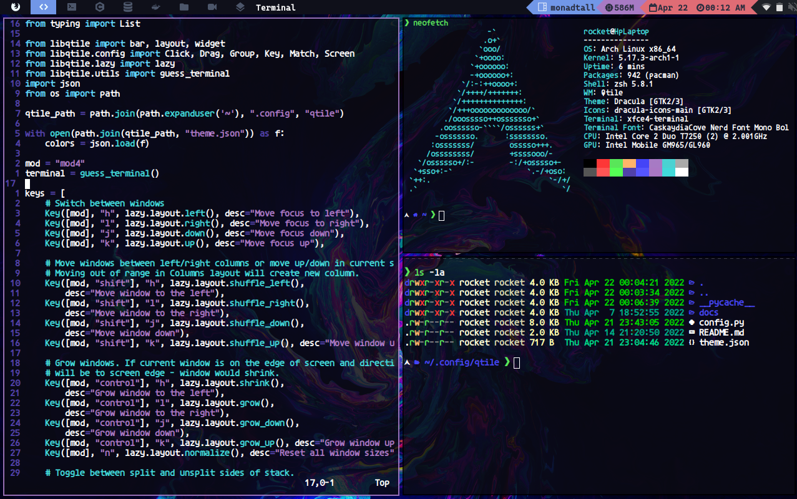

# Configuracion del WM Qtile
_Estas intrucciones te permitiran tener esta configuracion funcionando en tu dispositivo con una distribucion de linux instalada :)_



Primero lo primero instala Qtile y dependencias
```bash
sudo pacman -S qtile pacman-contrib
yay -S nerd-fonts-ubuntu-mono
pip install psutil
```

Clona este repositorio y copia el archivo donde se encuentran mis configuraciones
```bash
git clone https://github.com/denis360/config-qtile.git
cp -r config-qtile/config.py ~/.config/qtile
cp -r config-qtile/theme.json ~/.config/qtile
```

Instala un menu como dmenu o rofi
```
sudo pacman -S rofi
```
Puedes editar el atajo para abrir el menu en:
```python
key([mod], "space", lazy.spawn("rofi -show drun"))
```

## Fondo de pantalla y animaciones
No tendras fondo de pantalla asi que instala feh para tener uno y estar mas tranquilo
```bash
sudo pacman -S feh compton
```
```python
autostart = [
   "feh --bg-fill ~/ruta/al/fondo/de/pantalla",
   "compton -b -f &"

for i in autostart:
    os.system(i)
```

## Control del volumen
```
sudo pacman -S pamixer
```
Puedes editar la configuracion en:
```python
key([mod, "control"], "Up", lazy.spawn("pamixer --decrease 5")),
key([mod, "control"], "Down", lazy.spawn("pamixer --increase 5")),
key([mod, "control"], "m", lazy.spawn("pamixer --toggle-mute")),
```

## Control del brillo
No tendras control de tu brillo en pantalla asi que instala brightnessctl
```bash
sudo pacman -S brightnessctl
```
Puedes cambiar la configuracion en:
```python
key([mod, "shift"], "Up", lazy.spawn("brightnessctl set +10%")),
key([mod, "shift"], "Down", lazy.spawn("brightnessctl set -10%")),
```

